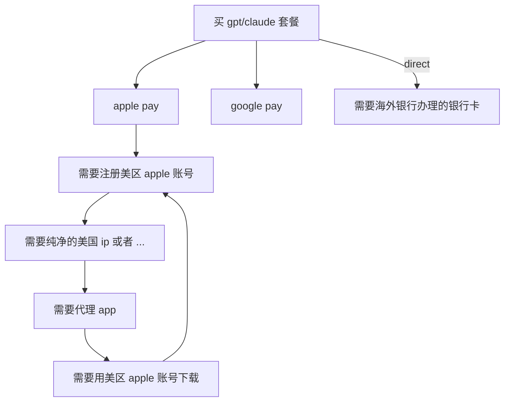

我感觉我现在两个都没有。

```mermaid
graph TD
    a[买 gpt/claude 套餐] --> b1[apple pay]
    b1 --> b2[需要注册美区 apple 账号]
    b2 --> b3[需要纯净的美国 ip 或者 ...]
    b3 --> b4[需要代理 app]
    b4 --> b5[需要用美区 apple 账号下载]
    b5 --> b2
    a --> c1[google pay]
    a --direct--> d1[需要海外银行办理的银行卡]
    
    
```

现在看来，有一个问题：就算我用的是纯净的美国家庭 IP，我也无法成功注册美区 apple 账号。可能的原因：

+ 我的手机号已经尝试注册了太多次，被他标记了
+ 我的邮箱已经尝试注册了太多次，被他标记了
+ 我的 IP 已经尝试注册了太多次，被他标记了
