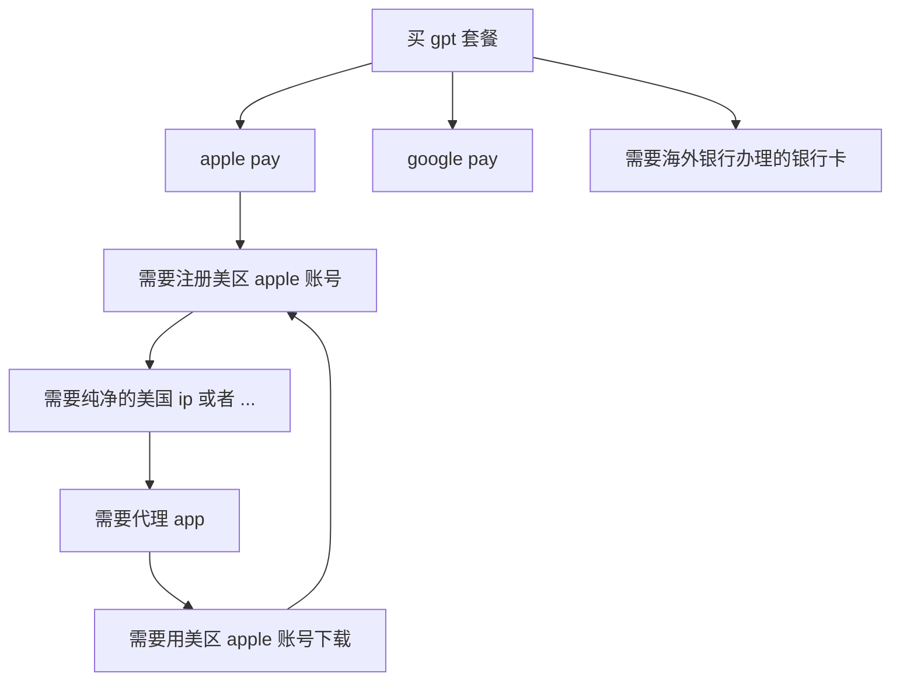

我感觉我现在两个都没有。买 gpt 套餐 -> 需要美区 apple 账号 -> 

```mermaid
graph TD
    a[买 gpt 套餐] --> b1[apple pay]
    b1 --> b2[需要注册美区 apple 账号]
    b2 --> b3[需要纯净的美国 ip 或者 ...]
    b3 --> b4[需要代理 app]
    b4 --> b5[需要用美区 apple 账号下载]
    b5 --> b2
    a --> c1[google pay]
    a --> d1[需要海外银行办理的银行卡]
    
    
```
                                                